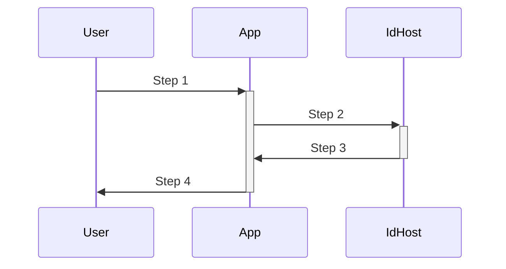

# The DID Web Authorization Framework

## Abstract

The DID Web Authorization Framework expands upon the [did:web spec][did-web-spec] 
enabling cross-domain authentication and the ability to grant and revokable 
access to protected HTTP resources to other identities.

[[table of contents here]]


## Introduction

As of 2023 authentication on the web is dominated by OAuth2. One-click-login 
buttons are limited to a small set of mega corporations. This is not open 
enough. A truly open authentication framework would allow you to host your 
identifiers and credentials anywhere you like. And ideally move them at will. 

What's wrong with OAuth 2.0? In short [OAuth 2.0][oauth-2-spec] 
was never designed to be a decentralized authentication framework. Oauth 2.0 
was designed to enable a third-party application to obtain limited access to 
an HTTP service on behalf of a user. It later reached massive adoption when 
it was used to simplify the signup and login process with one-click-login.

The major limitation with using OAuth2 as a basis for decentralized 
authentication is [The NASCAR Problem](https://indieweb.org/NASCAR_problem). 
There is only so much room for "sign in with X" brands. 

The DID Web Authorization Framework addresses these limitations by introducing 
decentralized cooperative protocols that allow any domain to both host and 
consume cross-domain identifiers and credentials.

Instead of authenticating in with an email and password, or with a major 
centralized brand, users can authenticate using any valid identity hosted 
at any domain. 

This specification is designed for use with HTTP ([RFC2616][http-spec]). The 
use of The DID Web Authorization Framework over any protocol other than HTTP 
is out of scope.


### Roles

- Identifier host
  - An http domain hosting [did:web][did-web-spec] [identifiers][did-spec]

- Identifier
   - A unique resource representing an individual human or organization
   - Can be granted revocable rights via verifiable credentials

- Client
  - An application making protected resource requests on behalf of an 
    individual human or organization using one unique identifier and one or 
    more credentials.


-----

### Protocol Flow


```
Alice visits app1.com
Alice registers a new identity alice@app1.com
Alice visits app2.com
Alice authenticates with alice@app1.com
app2 requests HTTP GET https://app1.com/.well-known/did.json (cachable)
app2 requests HTTP GET https://app1.com/dids/alice/did.json (latest)
app2 requests HTTP GET https://app1.com/dids/alice/auth
depending on the response from app1, app2 chooses a compatible 
authenticaiton method
(we could do a one-time-code here)
Alice is redirected to https://app1
```

## Authentication Methods

- messaged a one-time-code
- messaged a magic link
- http redirect dance


## Hosted Identifiers

A hosted identifier is a [DID][did-spec] using the [did:web method]
[did-web-spec] at a specific host domain. See the [did:web spec]
[did-web-spec] for details on formatting and encoding.

A hosted identifier can be presented in several formats:


##### DID using public key

`did:web:example.com:dids:z6MkhvoSQhPDNwotybwX9o2scoSvkx5Syem3GiM9FV8h5YXG`

##### DID using alias

`did:web:example.com:dids:alice`

##### Email using public key

`z6MkhvoSQhPDNwotybwX9o2scoSvkx5Syem3GiM9FV8h5YXG@example.com`

##### Email using alias

`alice@example.com`

##### URI using public key

`https://example.com/dids/z6MkhvoSQhPDNwotybwX9o2scoSvkx5Syem3GiM9FV8h5YXG/did.json`

##### URI using alias

`https://example.com/dids/alice/did.json`


### Encoding

Public keys should always be encoded as strings using 
[URL Safe Base64 Encoding](https://www.rfc-editor.org/rfc/rfc4648).


### TLS 

Transport Layer Security is considered essential at all times. Using this 
protocol over insecure connections is not recommended.


### HTTP Redirections

This specification makes extensive use of HTTP redirections, in which the 
client or the authorization server directs the resource owner's user-agent 
to another destination.  While the examples in this specification show the 
use of the HTTP 302 status code, any other method available via the 
user-agent to accomplish this redirection is allowed and is considered to be
an implementation detail.


### Notational Conventions

   The key words "MUST", "MUST NOT", "REQUIRED", "SHALL", "SHALL NOT",
   "SHOULD", "SHOULD NOT", "RECOMMENDED", "MAY", and "OPTIONAL" in this
   specification are to be interpreted as described in [RFC2119].

   This specification uses the Augmented Backus-Naur Form (ABNF)
   notation of [RFC5234].  Additionally, the rule URI-reference is
   included from "Uniform Resource Identifier (URI): Generic Syntax"
   [RFC3986].

   Certain security-related terms are to be understood in the sense
   defined in [RFC4949].  These terms include, but are not limited to,
   "attack", "authentication", "authorization", "certificate",
   "confidentiality", "credential", "encryption", "identity", "sign",
   "signature", "trust", "validate", and "verify".

   Unless otherwise noted, all the protocol parameter names and values
   are case sensitive.


### Client Registration

Unlike OAuth there is not client registration. Any http host that complies 
with this specification should interoperate with any other. 

## DNS Attack Prevention

To protect against 
[DNS attacks](https://w3c-ccg.github.io/did-method-web/#dns-security-considerations) 
an additional response header containing a signature of the body is required 
for all responses that don't return a signed response (like a JWT). 

The signature must be from a key present in the current domain did document.


## Protocol Endpoints

Any HTTP domain can host [did:web][did-web-spec] [identifiers][did-spec].
Hosting DIDs require the host to respond to the following endpoints:

- host did document endpoint
- identity did document endpoint
- authentication endpoint
- message endpoint


### Host DID Document Endpoint

The host should have its own identity as a did document in accordance to the 
[Well Known DID Configuration](https://identity.foundation/.
well-known/resources/did-configuration/) spec.
 
An HTTPS GET request to `https://${origin}/.well-known/did.json` should 
return  valid DID Document including at least one signing keys pair.

*response body signature header required*

### Identity DID Document Endpoint

GET `https://${origin}/dids/${id}/did.json` 

A valid DID Document including at least one signing keys pair.


### Authentication Endpoint

Optional endpoint to support cross-domain authentication.

POST `https://${origin}/dids/${id}/auth`

#### Authentication


### Message Endpoint

Optional endpoint to receive message for an identifier

POST `https://${origin}/dids/${id}/inbox`


## Authentication Flow

### Roles


#### User

The human interacting with a device. 

#### App

The website or app the user is trying to signup with or signin to. 

#### Identity Host

The web application hosting the identifier the user is trying to use to signin.

### Flow



1. User visits a new app and gives them their did in email address form
2. The app extracts the host from the email and checks if that host is a 
   valid DID Web identity host by getting and validating:
   * host did document from `https://${host}/.well-known/did.json`
   * user did document from `https://${host}/dids/${username}/did.json`
   * *what to do here if the host is invalid is outside the scope of this 
     document but a fallback to a more classic form of authentication might 
     be appropriate here.* 
3. The app uses one of the 4 authentication strategies to request a session 
   token.
4. Success. The app can now use your session token to gain limited access to 
   other api endpoints on your identity host.

#### Authentication Strategies

##### Magic Link

*This strategy only possible if the destination app has a public http 
endpoint*

1. The app generates a one-time secret login token, embeds it into a url 
   and post that to the Authentication endpoint
2. The app then instructs the user to follow the link sent to their identity 
   host


##### Secret Code

*This strategy the only strategy available to *

1. The app generates a one-time secret login token, persists a copy of it, 
   embeds it into a callback url and posts that url to the Authentication 
   endpoint.
2. The app then instructs the user to follow the link sent to their identity 
   host
3. The user follows the link sent to their identity host

##### Redirect Dance

*This strategy only possible if user is authenticating to a website in a 
browser*

1. The app redirects the user to their identity host's authentication 
   endpoint using query params to define the scopes for the requested session
2. the user is propmpted to confirm the details of the session request
3. the user approves the session and is redirected back to the app


##### Identity Host Prompt

*this strategy requires that the identity host have a UX*

4. The app requests 


## Credentials

### Granting a Credential

TDB…

### Verifying a Credential

Credentials are revokable so verifying applications should request updated 
copies before granting access. 


[http-spec]: https://www.rfc-editor.org/rfc/rfc2616
[did-spec]: https://www.w3.org/TR/did-core/
[did-web-spec]: https://w3c-ccg.github.io/did-method-web/
[oauth-2-spec]: https://www.rfc-editor.org/rfc/rfc6749#section-1.1