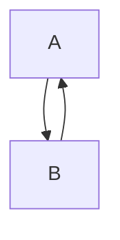
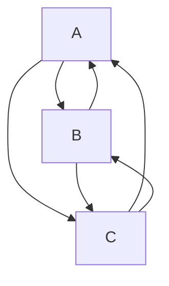

# Channels

Channels use two or more [Micro Ledgers](/docs/micro-ledgers) to communicate. 

Since [Micro Ledgers](/docs/micro-ledgers) are single-author we can only send data out by appending new events to the ledger. So there needs to be at least one stream to emit on and one other stream to listen to.

## Pairwise Channel

**Example:** I make a new Micro Ledger and share the address with you, you also make a new Micro Ledger and share the address with me. Now both parties can subscribe to and react to events from the other and view versa.




## Multiparty Channels




## Opening a channels

```js

const channel = {}
// Create a micro ledger
channel.emitLedger = await jlinx.create()

// share the id with someone some-how (http maybe)
console.log(`Share this ${channel.emitLedger.id}`)

// their micro-ledger id someone
channel.recvLedger = await jlinx.get('jlinx:fda0…')

// read events
channel.recvLedger.length
for (const event in channel.recvLedger.events()){
  console.log({ event })
}

// subscribe to events
channel.recvLedger.on('event', event => {
  console.log({ event })
})

// send an event
await channel.emitLedger.append({ 
  event: 'example-event',
  plus: 'more',
})

```
